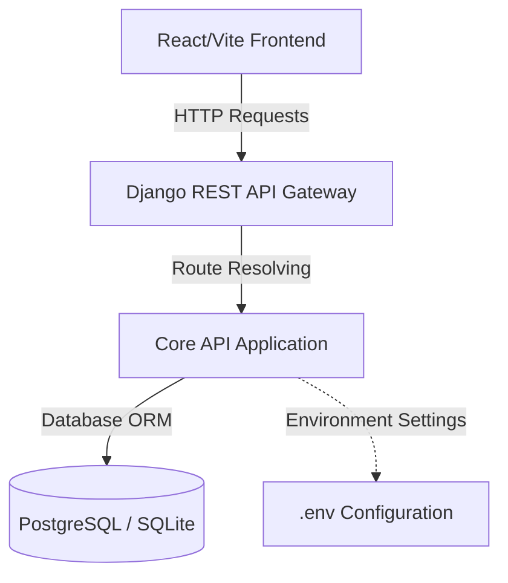

# CarbonBridge Architecture

This document outlines the high-level architecture of **CarbonBridge**, an enterprise Environmental, Social, and Governance (ESG) platform.



## Technology Stack

### Backend
- **Framework**: Django 5
- **API Framework**: Django REST Framework (DRF)
- **Database**: PostgreSQL (Production ready) / SQLite (Local fallback)
- **CORS Handling**: `django-cors-headers`
- **Environment Management**: `python-dotenv`

### Frontend
- **Framework**: React (built with Vite)
- **Language**: TypeScript
- **HTTP Client**: Axios
- **Icons**: Lucide React
- **Router**: React Router (`react-router-dom`)

---

## Directory Layout

```
CarbonBridge/
├── backend/            # Django application
│   ├── carbonbridge/   # Django project root settings
│   ├── core/           # Core API modules (health check, models, general views)
│   └── requirements.txt
├── frontend/           # React + TS + Vite application
│   ├── src/            # Components, styles, assets
│   ├── package.json
│   └── vite.config.ts
├── docs/               # System and architecture documentation
└── sample-data/        # Placeholder ESG and carbon emission sample sets
```

## Communication & API Interface

All communication between the Frontend client and Django Backend is handled via REST APIs over JSON.

### Endpoint: Health Check
- **Route**: `GET /api/health/`
- **Controller**: `core.views.health_check`
- **Response**:
  ```json
  {
    "status": "ok"
  }
  ```
- **Description**: Verifies integration connectivity and guarantees CORS headers are active.
